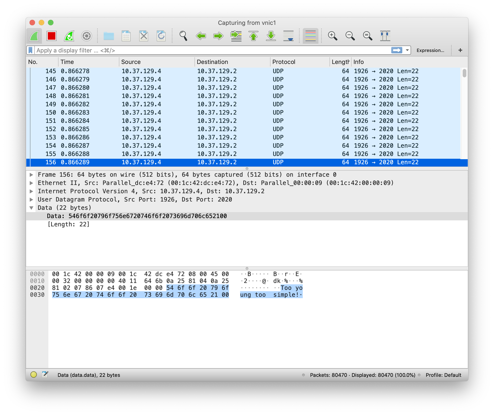

# Lab 2 – send and receive packets with DPDK

## Part 1: Get familiar with DPDK

**Q1**: What’s the purpose of using hugepage?

**A1**: Using hugepage is for performance consideration. Increasing page size reduces number of records in page table. As TLB has a fixed size, this will reduce TLB miss rate, and thus improves performance.

**Q2**: Take examples/helloworld as an example, describe the execution flow of DPDK programs?

**A2**:

1. Environment Abstraction Layer (EAL) Initialization

   ```c
   ret = rte_eal_init(argc, argv);
   if (ret < 0)
     rte_panic("Cannot init EAL\n");
   ```

   In this part, EAL options from command line was used to intialize basic runtime environment of DPDK.

2. Starting Application Unit Lcores

   ```c
   /* call lcore_hello() on every slave lcore */
   RTE_LCORE_FOREACH_SLAVE(lcore_id) {
     rte_eal_remote_launch(lcore_hello, NULL, lcore_id);
   }
   
   /* call it on master lcore too */
   lcore_hello(NULL);
   ```

   `RTE_LCORE_FOREACH_SLAVE` iterates over all available slave logical cores, and launches functions on these lcores. Then function is also lauched on master lcore.

**Q3**: Read the codes of examples/skeleton, describe DPDK APIs related to sending and receiving packets.

**A3**:

1. `rte_eth_rx_burst()`

   Retrieve a burst of input packets from a receive queue of an Ethernet device. The retrieved packets are stored in `rte_mbuf` structures whose pointers are supplied in the `rx_pkts` array. The `rte_eth_rx_burst()` function returns the number of packets actually retrieved.

2. `rte_eth_tx_burst()`

   Send a burst of output packets on a transmit queue of an Ethernet device. The `rte_eth_tx_burst()` function returns the number of packets it actually sent.

**Q4**: Describe the data structure of `rte_mbuf`.

**A4**: `rte_mbuf` is used to store message buffers. The message buffers are stored in a mempool, using the RTE mempool library. Message buffers are used to carry network packets, and one packet may be scattered into several message buffers (will be linked by `next` field in `rte_mbuf`).

   ```c
struct rte_mbuf {
    /* code ommitted */
    void *buf_addr;           /* virtual address of the buffer */

    /* code ommitted */
    union {
        rte_atomic16_t refcnt_atomic; 
        uint16_t refcnt;
    };                        /* buffer reference counter */
    uint16_t nb_segs;         /* number of segments */
    uint16_t port;            /* input port of the buffer */
    /* code ommitted */
    uint32_t pkt_len;         /* total packet length (of all the segments) */
    uint16_t data_len;        /* data length (in segment buffer) */
    union {
        union {
            /* code ommitted */
        } hash;
    };                        /* hashcode */
    uint16_t buf_len;         /* length of the segment buffer */
    /* code ommitted */
    struct rte_mempool *pool; /* the belonging mempool of mbuf */
    struct rte_mbuf *next;    /* next mbuf segment of the packet */
    /* code ommitted */
    uint32_t seqn;            /* sequence number */
    /* code ommitted */
} __rte_cache_aligned;
   ```


## Part 2: send packets with DPDK



I set each packet to have a total length of 64 Bytes, with 14 Bytes Ethernet header, 20 Bytes IPv4 header, 8 Bytes UDP header and 22 Bytes payload.

As seen in Wireshark, packets are correctly sent from DPDK to host, with MAC address, IP address, port and payloads all correct.
