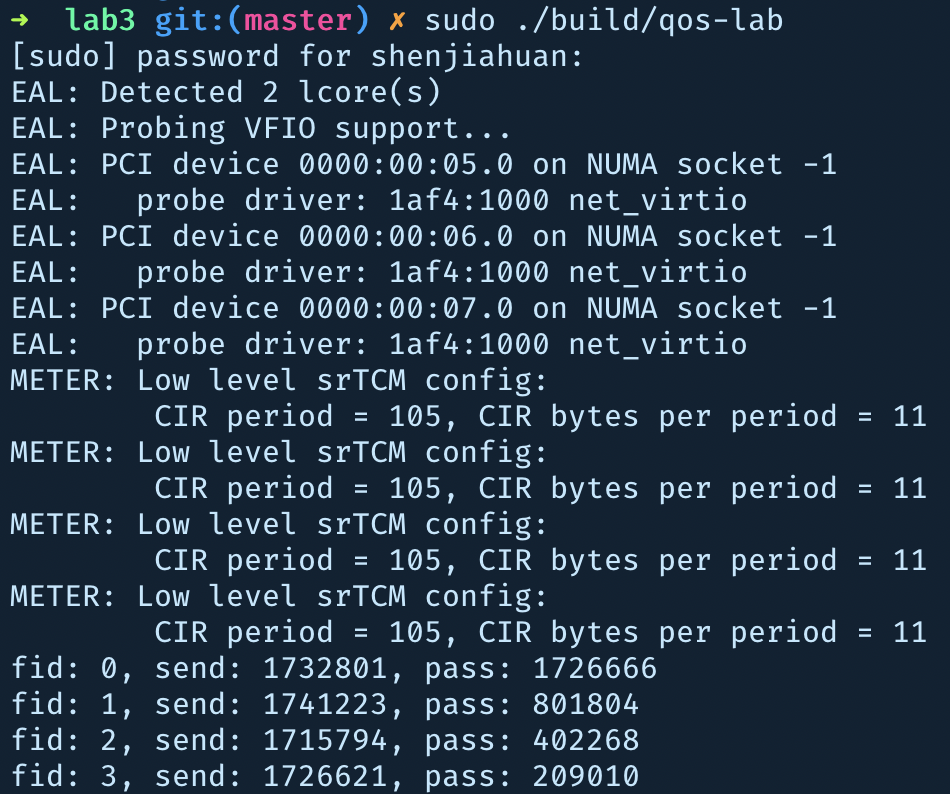
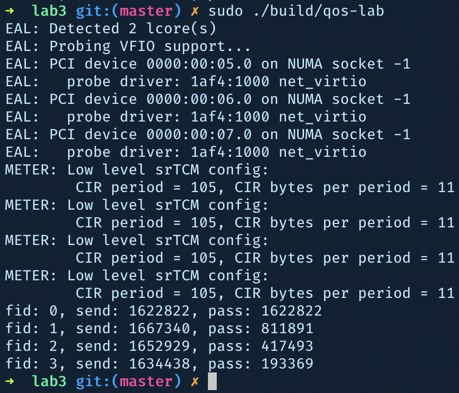

# Lab 3 – QoS Implementation with DPDK

- 517021910872
- 沈嘉欢
- shenjiahuan [at] sjtu.edu.cn

## Introduction to DPDK APIs used

### srTCM

1. `int rte_meter_srtcm_config(struct rte_meter_srtcm *m, struct rte_meter_srtcm_params *params);`
   - `struct rte_meter_srtcm *m` is the data sturcture that holds necessary information about srTCM algorithm, such as `tc` (Number of bytes currently available in the committed (C) token bucket), `te` (Number of bytes currently available in the excess (E) token bucket), etc.
   - `struct rte_meter_srtcm_params *params` holds the input param for srTCM.
     - `cir`: Number of tokens to fill into buckets every second.
     - `cbs`: Capacity of the committed (C) token bucket.
     - `ebs`: Capacity of the excess (E) token bucket.
   - For each flow, the params are not same, and will have a unique srTCM data structure. Thus here we need 4.

2. `uint64_t rte_get_tsc_hz(void)`
   - This function returns CPU frequency in Hz.
   - As `rte_meter_srtcm_color_blind_check` requires CPU clocks as parameter, we need to convert nano second into CPU clock.
3. `rte_get_tsc_cycles`
   - This functions returns number of CPU cycles since boot.
4. `enum rte_meter_color rte_meter_srtcm_color_blind_check(struct rte_meter_srtcm *m, uint64_t time, uint32_t pkt_len)`
   - This function contains main logic of stTCM algorithm. Three params are required:
     - srTCM data structure of corresponding flow.
     - time of packet arrival, calculated in CPU cycles.
     - length of packet.

### WRED

1. `int rte_red_rt_data_init(struct rte_red *red)`

   - Initialize RED data structure.
   - Each color of each flow will have one, so 12 in total.

2. `int rte_red_config_init(struct rte_red_config *red_cfg, const uint16_t wq_log2, const uint16_t min_th, const uint16_t max_th, const uint16_t maxp_inv);`

   - Initialize RED config.

   - Params:

     - `red_cfg`: RED configuration data structure.
     - `wq_log2`: this is the coefficient in EWMA, indicates whether to calculate average of more recent time or longer time.
       - $avg_{n} = (1-wq) \cdot avg_{n-1} + wq \cdot q_{n-1}$.
       - $wq = \frac{1}{2^{wq\_log2}}$.
     - `min_th`: when avg length is less than `min_th`, packet will be passed directly.
     - `max_th`: when avg length is larger than `max_th`, packet will be dropped directly.
     - `maxp_inv`: inverse of maxp, determines possibility of dropping packets when avg length is between `min_th` and `max_th`. Larger value indicates less probability of dropping packets.

3. `void rte_red_mark_queue_empty(struct rte_red *red, const uint64_t time)`
   - Mark each RED data structure to be empty at given time.
   - As mentioned in lab document: "we assume the queues will be cleared (meaning all packets in the queues will be sent out) at end of the time period", this method is called when current burst time is not equal to previous one.
4. `int rte_red_enqueue(const struct rte_red_config *red_cfg, struct rte_red *red, const unsigned q, const uint64_t time)`
   - This function contains main logic of RED algorithm. Four params are required:
     - RED configuration.
     - RED data structure.
     - Current queue length.
     - Time to enqueue.
   - If this function returns zero, the packet is passed, otherwise dropped.

## Parameter deduction

There are many ways to achieve required goal, I will list two of them.

### Solution 1

In this solution:

- srTCM's parameters will differ among flows. 
  
  - Flow 0 have most green packets and flow 3 have most red packets.
  
- For simplicity, assume at the beginning of each burst, state of srTCM will be the same. That is, both buckets have been filled during the gap of two bursts.
  - `cir` should be large enough. In our case, during each burst, each flow will receive 250 packets and each 640 bytes on average, and gap between each burst is 1ms. So `cir` should be greater than 250 * 640 / 0.001 = 160,000,000.
  - In order to handle situations like one flow will receive more bytes than average, I choose `cir` to be 240,000,000.
  - If size of two buckets cannot fit all packets in a burst, `cir` could be smaller, but I just set it to be large enough for simplicity.
  
- During a burst, one flow will receive 250 * 640 = 160,000 bytes on average. 
  - In order to mark all packets as green packets in flow 0, `cbs` of flow 0 will be at least 160,000.
  - To handle situations when flow 0 receives more bytes than average, I choose `cbs` of flow 0 to be 240,000. `ebs` of flow 0 can be arbitary as C bucket can fit all packets.
  - `cbs` of flow 1 is chosen to be 80000, so half of the packets are green; `cbs` of flow 2 is chosen to be 40000, so a quater of the packets are green; `cbs` of flow 2 is chosen to be 20000, so one-eighth of the packets are green. `ebs` is set to be equal to `cbs` in each case, that number of yellow packets are approximately same as green packets.

- RED treats each flow equally.

  - Each color will have different RED configurations, but same color in different flows will have the same configuration.
  - All green packets should pass through successfully, so `min_th` and `max_th` of green packets should be set to be large enough.
    - Each flow in each burst will send 250 packets on average, so `min_th` and `max_th` of green packets should be at least 250. To handle situations when green packets are more than average, these values should be larger. So I choose 511 and 512.
    - As parameters chosen in srTCM has guaranteed that flow n will have half of green packets than flow n-1, and all green packets can pass through, we can reach required flow bandwidth proportion by setting threshold of yellow and red packets to be relatively small.
    - `maxp_inv` does not have much meaning in this configuration, as `min_th` is large enough for green packets and `max_th` is small enough for green and red packets.
    - `wq_log2` is chosed arbitrarily.

- Full configuration:

  - srTCM
  
    - | Flow | `cir`     | `cbs`  | `ebs`  |
      | ---- | --------- | ------ | ------ |
      | 0    | 240000000 | 240000 | 240000 |
      | 1    | 240000000 | 80000  | 80000  |
      | 2    | 240000000 | 40000  | 40000  |
      | 3    | 240000000 | 20000  | 20000  |
    
  - WRED
  
    - Flow 0-3
  
      | Color  | `min_th` | `max_th` | `maxp_inv` | `wq_log2` |
      | ------ | -------- | -------- | ---------- | --------- |
      | Green  | 511      | 512      | 10         | 5         |
      | Yellow | 10       | 11       | 5          | 5         |
      | Red    | 1        | 2        | 5          | 5         |
  
- Result

  

### [BONUS] Solution 2

In this solution:

- srTCM's parameters will be the same among flows. 
  - `cir`'s configuration is the same as Solution 1 with the same concern.
  - `cbs` and `ebs` has the same configuration as Flow 1 in Solution 1, that nearly half of the packets are green and half are yellow, few packets are red.

- RED treats each flow differently.
  - In order to give flow 0 the highest priority and flow 3 the lowest,  `min_th` and `max_th` must be different for each flow.
  - All packets of flow 0 should be passed, so length of all three queue should be large enough.
  - By reducing `min_th`, `max_th` and `maxp_inv`, more packets can be dropped. 

- Full configuration:

  - srTCM

    - | Flow | `cir`     | `cbs` | `ebs` |
      | ---- | --------- | ----- | ----- |
      | 0-3  | 240000000 | 80000 | 80000 |
    
  - WRED

    - Flow 0

      | Color  | `min_th` | `max_th` | `maxp_inv` | `wq_log2` |
      | ------ | -------- | -------- | ---------- | --------- |
      | Green  | 511      | 512      | 10         | 5         |
      | Yellow | 511      | 512      | 10         | 5         |
      | Red    | 511      | 512      | 10         | 5         |
    
    - Flow 1

      | Color  | `min_th` | `max_th` | `maxp_inv` | `wq_log2` |
      | ------ | -------- | -------- | ---------- | --------- |
      | Green  | 256      | 512      | 10         | 5         |
      | Yellow | 32       | 64       | 5          | 5         |
      | Red    | 1        | 2        | 1          | 5         |

    - Flow 2

      | Color  | `min_th` | `max_th` | `maxp_inv` | `wq_log2` |
      | ------ | -------- | -------- | ---------- | --------- |
      | Green  | 32       | 44       | 5          | 5         |
      | Yellow | 4        | 8        | 3          | 5         |
      | Red    | 1        | 2        | 1          | 5         |

    - Flow 3

      | Color  | `min_th` | `max_th` | `maxp_inv` | `wq_log2` |
      | ------ | -------- | -------- | ---------- | --------- |
      | Green  | 12       | 18       | 4          | 5         |
      | Yellow | 1        | 2        | 2          | 5         |
      | Red    | 1        | 2        | 1          | 5         |

- Result